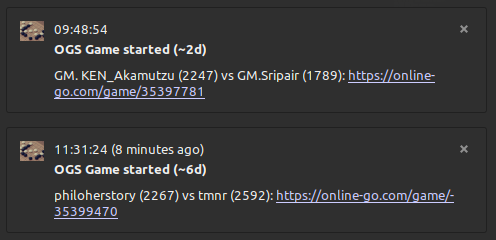

# OGSGameNotifier

System tray application that notifies you when high rated dan games on
http://www.online-go.com/ occurs. Created because I like to watch high
quality games of Go and develop applications in Go.

# Features

Example notification under Linux Mint 20.1 Cinnamon:


* Systemtray app with settings
* OS specific notifications
* Prebuilt binaries for Windows and Linux

## TODO

* Unit tests
* Reconnect websocket on disconnection (network errors)
* Notifications for pro games
* Blacklist players

# Install

Prebuilt binaries for Windows and Linux are found under releases.

# Build from source

Built with go version go1.13.8 linux/amd64 on Linux Mint 20.1 Cinnamon,
anything else is untested and may require more steps from the dependency list below.

## Requirements

* Go (version>=1.13.8) https://golang.org/doc/install
* systray: `sudo apt-get install gcc libgtk-3-dev libappindicator3-dev libxapp-dev`

## Steps

```sh
> git clone https://github.com/vidfamn/OGSGameNotifier.git
> cd OGSGameNotifier
> make build
```
On success, binaries will be found in the `bin`-directory.

# Dependencies

* https://github.com/gen2brain/beeep
* https://github.com/getlantern/systray
* https://github.com/hashicorp/go-memdb
* https://github.com/ambelovsky/gosf-socketio

# Helpful resources

Since OGS does not have any proper documentation, I had to reverse
engineer some parts. I also found the following resources helpful:

* https://github.com/dylanross620/Rengo-Bot
* https://github.com/flovo/ogs_api

# License
<a rel="license" href="http://creativecommons.org/licenses/by/4.0/"></a><br /><span xmlns:dct="http://purl.org/dc/terms/" href="http://purl.org/dc/dcmitype/Text" property="dct:title" rel="dct:type">OGSGameNotifier</span> by <a xmlns:cc="http://creativecommons.org/ns#" href="https://www.github.com/vidfamn" property="cc:attributionName" rel="cc:attributionURL">Sonny Vidfamn</a> is licensed under a <a rel="license" href="http://creativecommons.org/licenses/by/4.0/">Creative Commons Attribution 4.0 International License</a>.<br />Based on a work at <a xmlns:dct="http://purl.org/dc/terms/" href="https://www.github.com/vidfamn/OGSGameNotifier" rel="dct:source">https://www.github.com/vidfamn/OGSGameNotifier</a>.